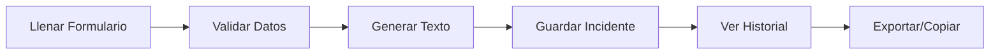

# 🎯 Plantilla de Gestión de Incidentes

<div align="center">
  


**Sistema web profesional para gestión y cierre de incidentes**

[📖 Documentación Técnica](./README-PROYECTO-TECNICO.md) | [🚀 Guía de Despliegue](./DESPLIEGUE-GITHUB-PAGES.md)

</div>

---

## ✨ Características Principales

- 📝 **Formulario Inteligente** - Validaciones en tiempo real con Reactive Forms
- 💾 **Historial Persistente** - Almacenamiento local de todos los incidentes
- 🔍 **Búsqueda Avanzada** - Filtros por múltiples criterios
- 📊 **Estadísticas** - Panel con métricas en tiempo real
- 📥 **Exportación** - Descarga datos en JSON y CSV
- 🎨 **Diseño Moderno** - Interfaz responsive 100% adaptable
- 🚀 **Autocompletado** - Sugerencias inteligentes mientras escribes
- 📋 **Copia Rápida** - Al portapapeles con un clic

## 🚀 Inicio Rápido

### Instalación

```bash
# Instalar dependencias
npm install

# Ejecutar en desarrollo
ng serve

# Abrir en navegador: http://localhost:4200
```

### Compilar para Producción

```bash
ng build --configuration production
```

## 🌐 Desplegar en GitHub Pages

### Método 1: Automático (Recomendado) ⭐

El proyecto incluye **GitHub Actions** configurado. Solo necesitas:

```bash
# 1. Crear repositorio en GitHub
# 2. Conectar tu proyecto
git remote add origin https://github.com/TU-USUARIO/TU-REPOSITORIO.git

# 3. Subir el código
git add .
git commit -m "Initial commit"
git push -u origin main

# 4. GitHub Actions desplegará automáticamente
# Tu sitio estará en: https://TU-USUARIO.github.io/TU-REPOSITORIO/
```

### Método 2: Script Manual

```powershell
# 1. Editar deploy.ps1 con tu usuario y repositorio

# 2. Ejecutar el script
.\deploy.ps1

# ¡Listo! Tu sitio estará publicado en minutos
```

📖 **[Ver guía completa de despliegue](./DESPLIEGUE-GITHUB-PAGES.md)** con todos los métodos paso a paso.

## 📂 Estructura del Proyecto

```
incidentes-angular/
├── src/app/
│   ├── components/
│   │   ├── formulario-incidente/    # Formulario principal
│   │   └── historial-incidentes/    # Historial y estadísticas
│   ├── services/
│   │   ├── incidente.ts             # Lógica de negocio
│   │   └── storage.ts               # Persistencia LocalStorage
│   └── models/
│       └── incidente.ts             # Interfaces TypeScript
├── .github/workflows/
│   └── deploy.yml                   # GitHub Actions CI/CD
├── deploy.ps1                       # Script de despliegue
└── DESPLIEGUE-GITHUB-PAGES.md      # Guía completa
```

## 🛠️ Tecnologías

| Tecnología | Versión | Uso |
|------------|---------|-----|
| Angular | 19 | Framework principal |
| TypeScript | 5.0+ | Lenguaje |
| SCSS | - | Estilos |
| Reactive Forms | - | Formularios |
| LocalStorage | - | Persistencia |
| GitHub Actions | - | CI/CD |

## 📊 Características Detalladas

### Formulario de Incidentes

✅ **Validaciones en Tiempo Real**
- Campos obligatorios marcados con *
- Mensajes de error específicos
- Prevención de valores inválidos

✅ **Autocompletado Inteligente**
- 34 opciones predefinidas de agrupadores
- Filtrado mientras escribes
- Selección con un clic

✅ **Generación Automática**
- External Ticket actualizado en tiempo real
- Texto formateado listo para copiar
- Vista previa instantánea

### Historial de Incidentes

📊 **Panel de Estadísticas**
- Total de incidentes guardados
- Número de aplicativos únicos
- Visualización en tiempo real

🔍 **Búsqueda y Filtros**
- Buscar por texto en múltiples campos
- Filtrar por aplicativo específico
- Resultados instantáneos

📥 **Exportación de Datos**
- Formato JSON para sistemas externos
- Formato CSV para Excel/Sheets
- Descarga directa con un clic

## 🎨 Capturas

<div align="center">

### Vista del Formulario
*Interfaz moderna con validaciones en tiempo real*

### Panel de Historial
*Gestión completa de todos los incidentes*

</div>

## 🔄 Flujo de Trabajo



1. **Crear** → Llenar formulario con validaciones
2. **Generar** → Ver preview del texto
3. **Guardar** → Almacenar en historial
4. **Consultar** → Buscar y filtrar
5. **Exportar** → Descargar o copiar

## 📖 Documentación Completa

- 📘 [Guía Técnica del Proyecto](./README-PROYECTO-TECNICO.md)
- 🚀 [Despliegue en GitHub Pages](./DESPLIEGUE-GITHUB-PAGES.md)
- ✅ [Resumen de Migración](./MIGRACION-COMPLETADA.md)

## 🎯 Comandos Útiles

```bash
# Desarrollo
ng serve                 # Servidor de desarrollo
ng serve --open          # Abrir en navegador
ng serve --port 4300     # Puerto personalizado

# Compilación
ng build                 # Build desarrollo
ng build --prod          # Build producción

# Mantenimiento
ng lint                  # Analizar código
ng test                  # Tests unitarios
```

## 🐛 Solución de Problemas

### ¿La aplicación no carga?
```bash
# Limpiar y reinstalar
rm -rf node_modules
npm install
```

### ¿Errores al compilar?
```bash
# Limpiar caché de Angular
rm -rf .angular
ng build
```

### ¿Problemas con GitHub Pages?
Ver [Guía de Despliegue](./DESPLIEGUE-GITHUB-PAGES.md) sección "Solución de Problemas"

## 🤝 Contribuir

¿Quieres mejorar el proyecto? ¡Genial!

1. Fork el proyecto
2. Crea una rama: `git checkout -b feature/mejora`
3. Commit: `git commit -m 'Agregar mejora'`
4. Push: `git push origin feature/mejora`
5. Abre un Pull Request

## 📝 Changelog

### v2.0.0 (2026-01-21)
- ✅ Migración completa a Angular 19
- ✅ Historial con LocalStorage
- ✅ Búsqueda y filtros avanzados
- ✅ Exportación JSON/CSV
- ✅ Diseño responsive moderno
- ✅ GitHub Actions CI/CD

### v1.0.0 (Original)
- Formulario básico con JavaScript vanilla
- Generación de texto
- Estilos CSS básicos

## 📄 Licencia

Este proyecto es de uso interno. Todos los derechos reservados.

## 👨‍💻 Autor

Sistema desarrollado para gestión profesional de incidentes.

Desarrollado con ❤️ usando Angular 19 y TypeScript

---

<div align="center">

**🌟 Dale una estrella si te fue útil**

[Reportar Bug](../../issues) · [Solicitar Feature](../../issues) · [Documentación](./README-PROYECTO-TECNICO.md)

</div>
